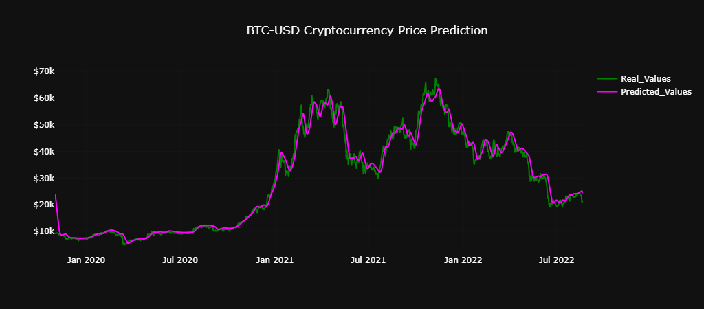

# <ins>Market Analyser<ins>
A Python application for the analysis and prediction of market assets, including Cryptocurrencies and Stocks.

## Developers
[CSynodinos](https://github.com/CSynodinos)

## Description
This application is able to analyse any asset data and make predictions on the price of such asset for the next day from the specified date. Predictions are made through the use of ML. Currently, the application supports only 1 model, the Long Short-Term Memory Recurrent Neural Network (LSTM-RNN). Future expansions will include more ML model options. The resulting analysis can either be displayed in a dashboard or in a jupyter notebook using matplotlib. The default behaviour is displaying the dashboard in a localhost instance, which is created using the Dash and Flask frameworks. All the data is stored in sqlite3 databases in the Databases subdirectory.

## Installation
Download the repository in your system and run installer.py
```bash
>>> curl https://raw.githubusercontent.com/CSynodinos/Market-Analyser

>>> installer.py -env [venv or conda] # Default is venv.

To see all the options available:
>>> installer.py -h
```

## Example
```bash
>>> asset_analysis.py -test True

To see all the options available:
>>> asset_analysis.py -h
```

The resulting dashboard localhost page from running the test profile:


The graph itself:



## Application Features

:heavy_check_mark: Download data from **YahooFinance**.

:heavy_check_mark: **SQLite3** database integration.

:heavy_check_mark: **ML/AI** integration, only **LSTM-RNN** supported currently.

:heavy_check_mark: **Matplotlib (seaborn)** support.

:heavy_check_mark: **Dashboard** support using **Dash** and **Flask**.

## CLI options
##### *Essential*:
    1. -ast: Market Asset. Needs to be written as: Asset_initials-currency

    2. -tp: Asset Type, etc. Cryptocurrency or Stock.

    3. -pd: Prediction days used for training. Must be a positive integer.

##### *Optional*:
    1. -db: SQLite3 Database name. Defaults: asset_name_data.db

    2. -d: Start date for data calls. Format: YYYY-MM-DD. Defaults: 2019-11-1.

    3. -tdy: End date for data calls is current date. 
        If False, add custom date with -y -m -d parameters. Defaults: True.

    4. -p: Port for localhost containing the dashboard. Defaults to 8050.

    5. -plt: Display seaborn plots. Useful for jupyter notebooks. Defaults to False.

    6. -test: Runs a test profile.

    7. -end_y: Year of end date for data calls. Only use when -tdy is set to False.

    8. -end_m: Month of end date for data calls. Only use when -tdy is set to False.

    9. -end_d: Day of end date for data calls. Only use when -tdy is set to False.

# Work-In-Progress Features

:small_red_triangle: All database queries to be conducted in a single database.

:small_red_triangle: Addition of more AI/ML options. Currently working on adding a **Convoluted NN** as an option.

:small_red_triangle: Postgres4 integration.

